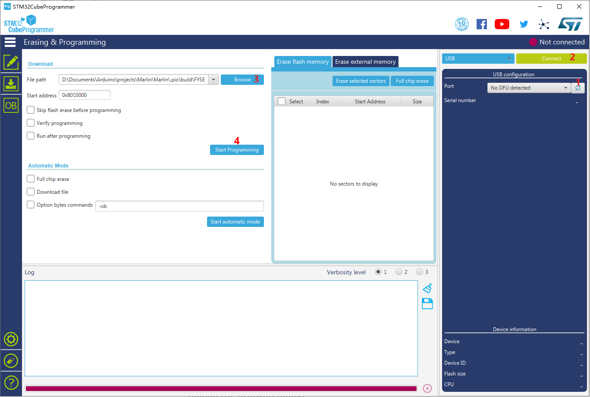

## Bootloader

**First of all, you need know that, the FYSETC S6 bootloader boot address have been change to `0x8000` since 2021/06/23. So the default bootloader `Bootloader-FYSETC_S6.hex` boot address is `0x8000`. And the old bootloader boot address is `0x10000`, and the repo still contains it, its name is  `Bootloader-FYSETC_S6_10000`. So when you are going to update the bootloader, you should choose the right one.** 

#### Upload the bootloader(DFU)

##### Download stm32cubeprogrammer 

You can download it from ST website.

https://www.st.com/zh/development-tools/stm32cubeprog.html

Open the STM32CubeProgrammer software.

##### Enter DFU mode

S6 v1.2

First power off the board , then push the Boot0 button and hold it , then connect the USB to the board and your computer , it will enter DFU mode . Now you can loose you hand from Boot0 button.

S6 v2.0

First power off the board , then jumper the Boot0 to 3.3v, then connect the USB to the board and your computer , it will enter DFU mode . 

***REMEMBER to remove the jumper if you finish uploading or it will enter DFU mode again.***

##### Upload the bootloader

Now you can connect and flash the S6 board with STM32CubeProgrammer with the following operation.

Do as the red number shows in the screen shot.

1. Click the button to flesh the DFU port.

2. Connect the DFU 

3. Choose the downloaded "Bootloader-FYSETC_S6.hex" file (If old bootloader, see below, choose `Bootloader-FYSETC_S6_10000`). 

6. Start Programming

**We will continue to update, please look forward to it!***

**You need know that, the FYSETC S6 bootloader boot address have been change to `0x8000` since 2021/06/23. So the default bootloader `Bootloader-FYSETC_S6.hex` boot address is `0x8000`. And the old bootloader boot address is `0x10000`, and the repo still contains it, its name is  `Bootloader-FYSETC_S6_10000`. So when you are going to update the bootloader, you should choose the right one.** 

## Tech Support
You can raise issue in our github https://github.com/FYSETC/FYSETC-S6/issues
Or submit any technical issue into our [forum](http://forum.fysetc.com/) 